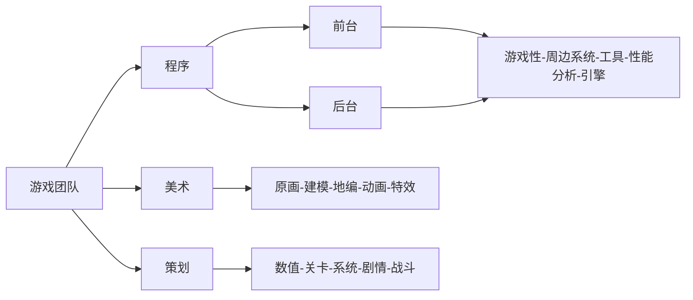
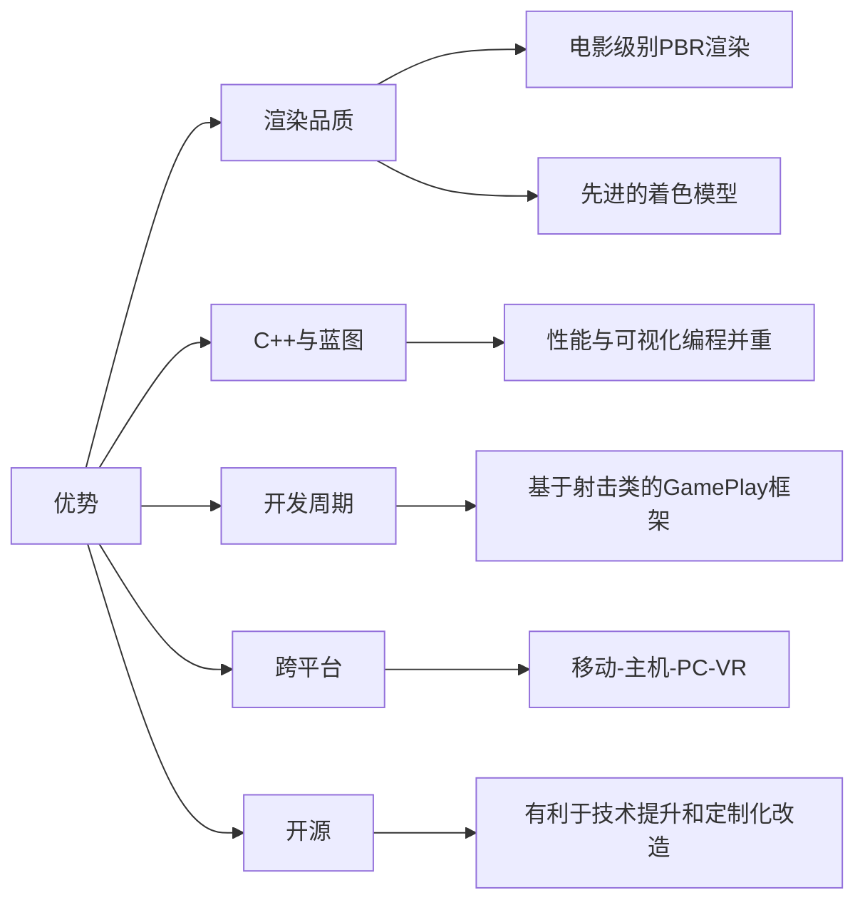

# 概览

>课程内容：
>- UE学习途径和方法的介绍
>- UE编辑器使用和编程技巧
>- UE引擎工具了解

>课程目标
	>-  熟悉UE引擎的编辑器操作，了解UE引擎的游戏模式框架
	>-  能够独立获取和编译UE源码
	>- 能够在UE引擎中实现蓝图编程和C++编程
	>- 能够使用UE引擎构建Andorid平台游戏安装包
	
>本节课程作业：
>- 源码编译UE4/5，新建一个C++工程，进行简单场景编辑和工程设置
>- 编译并构建安装包，确保能够用来将游戏工程安装到手机正常运行（若无Andorid手机可构建桌面版本）

# 游戏团队的典型结构

# 游戏引擎介绍

## Unreal

## 商业引擎
|名称|所属|是否开源|知名作品|
|:----:|:----:|:----:|:----:|
|Unity|Unity Technologies|闭源，商业引擎|大部分手游，独立游戏|
|Cry Engine|Crytek|开源，商业引擎|孤岛惊魂，孤岛危机|
|Source2|Valve|未开源，商业引擎|Half-Life: Alyx，CS2，Dota2|
|EA|Frostbit Engine|内部引擎|战地系列|
|顽皮狗|Naughty Dog Game Engine|内部引擎|神海系列，美末系列|
|R星|RAGE|内部引擎|GTA系列，荒野大镖客系列|
|育碧|AnvilNext2|内部引擎|刺客信条系列|
|动视|IW Engine（基于id Tech3）|内部引擎|使命召唤系列|

## 游戏引擎架构
>**推书**：Game Engine Architecture
<table>  
<tr align="center">  
<td colspan=2,>游戏子系统</td>  
<td rowspan=2>世界编辑器</td>  
</tr>  
<tr >  
<td align="center">动画</td> 
 <td>游戏基础系统</td>  
</tr>  
<tr align="center">  
<td>渲染引擎</td> 
<td>物理引擎</td>  
<td rowspan=2>工具</td> 
</tr>  
<tr align="center">  
<td colspan=2>资源管理</td>  
</tr>  
<tr align="center">  
<td colspan="3"> 核心系统</td> 
</tr>
</tr>  
<tr align="center">  
<td colspan="3"> 平台独立层</td> 
</tr>
</tr>  
<tr align="center">  
<td colspan="3"> 第三方SDK</td> 
</tr>
</tr>  
<tr align="center">  
<td colspan="3"> OS</td> 
</tr>
</tr>  
<tr align="center">  
<td colspan="3"> 硬件</td> 
</tr>
</table>

关于**世界编辑器**
- **世界编辑器**通常是**关卡编辑**和**地形编辑**等
- 一般的游戏引擎都是世界编辑器和游戏引擎独立开来，编辑好后再导入游戏引擎，而**UE**可以在运行过程中修改世界编辑器

## 游戏引擎：渲染

>**推荐**
>- 书：Real Time Rendering
>- 课程：GAMES101 & GAMES202
***
**渲染模式**
- Deferred Rendering（延迟渲染）
	- 编辑器、PC、Console默认渲染管线
- Forward+ Renderer
	- 用于桌面VR游戏，支持MSAA
- Mobile Renderer
	- Forward Render
	- Deferred Render
***
**游戏渲染模式**

- **Immediate Mode Rendering（立即渲染模式）**：正常处理，对能耗和带宽需求高，适用于PC游戏

- **Tile Based Rendering**：将屏幕划分为多个格子，一次只处理单个小块，有利于减小GPU的显存

- **Tile Based Deferred Rendering**：将渲染过程中看不见的东西提前去掉，减少运算量
***
>**正向渲染(Forward Rendering)**
>
>我们知道，正向渲染(Forward Rendering)，或称正向着色(Forward Shading)，是渲染物体的一种非常直接的方式，在场景中我们根据所有光源照亮一个物体，之后再渲染下一个物体，以此类推。  
>
>传统的正向渲染思路是，先进行着色，再进行深度测试。其的主要缺点就是光照计算跟场景复杂度和光源个数有很大关系。假设有n个物体，m个光源，且每个每个物体受所有光源的影响，那么复杂度就是O(m*n)。
>
>正向渲染简单直接，也很容易实现，但是同时它对程序性能的影响也很大，因为对每一个需要渲染的物体，程序都要对每个光源下每一个需要渲染的片段进行迭代，如果旧的片段完全被一些新的片段覆盖，最终无需显示出来，那么其着色计算花费的时间就完全浪费掉了
	
>**几何缓冲区（G-buffer）**
>
>G-Buffer，全称Geometric Buffer ，译作几何缓冲区，它主要用于存储每个像素对应的位置（Position），法线（Normal），漫反射颜色（Diffuse Color）以及其他有用材质参数。
>
>根据这些信息，就可以在像空间（二维空间）中对每个像素进行光照处理。

>**Deferred Rendering（延迟渲染）**
>
>可以将延迟渲染( Deferred Rendering)理解为先将所有物体都先绘制到屏幕空间的缓冲（即G-buffer，Geometric Buffer，几何缓冲区）中，再逐光源对该缓冲进行着色的过程，从而避免了因计算被深度测试丢弃的⽚元的着色而产⽣的不必要的开销。
>
>也就是说延迟渲染基本思想是，先执行深度测试，再进行着色计算，将本来在物空 间（三维空间）进行光照计算放到了像空间（二维空间）进行处理。
>
>对应于正向渲染O(m*n)的 复杂度，经典的延迟渲染复杂度为O(n+m)。
	
>**移动渲染**
>
>移动平台渲染器独立于桌面和控制台渲染器，具有自己的专门针对移动设备优化的功能子集。
>
>移动渲染 | 虚幻引擎文档 (unrealengine.com)

## 游戏引擎：物理

物理引擎包含的内容：碰撞检测，动态约束，刚体物理，车辆物理，布娃娃系统等等
	
知名物理引擎：
- Havok：先后被英特尔和微软收购，CPU友好，闭源，塞尔达使用的就是Havok
- PhysX：被Nvidia收购，GPU友好，集成于UE4和Unity
- Bullet：最早开源，用于GTA5，荒野大镖客等
	
UE如今开发了自己的物理引擎Chaos

