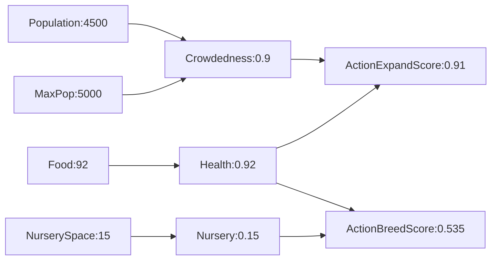

# 游戏AI技术概述

## 定义
**学术AI**：AI指一个可以观察周遭环境并作出行动以达致成功的系统
**游戏AI**： 满足玩家在游戏中的体验感

## 基础术语
- 玩家角色（Player Character）
- 电脑假冒的玩家角色（Bot）
- 敌人、对话村民（NPC ）

## 游戏AI的目的
1. 提升玩家的游戏代入感以及各种情感
2. 有趣，强度适中，满足玩家心流的挑战
3. 行为合理,没有明显破绽
4. 可能需要“真实”

## 游戏AI四大主题
### 环境感应
- 视野管理(通过物理系统)
- 听觉管理(NavMesh)
- 将复杂环境数据转化为便于Al系统理解的简单中间数据

### 知识管理
通过黑板(Blackboard)来作为数据共享，
- Agent黑板
- squad黑板

存储
- 消耗大的感应结果
- 寻路结果
- 分帧Plan的部分Plan结果

### 行为模型
- 没有万金油的行为模型能解决一切AlI问题
- 了解这些方法的核心思路，有助于选型、组合解决实际Al问题

#### 1.朴素脚本代码
- 如魔兽世界早期的boss，使用switch case 实现各种情况

#### 2.有限状态机（Finite State Machine，FSM）

- 本质是图
- 原理简单：—个时刻只处于一个状态，符合条件时跳转状态
- 随着状态增多，状态间跳转可能会平方级增长
- 状态的重用性差，状态Copy Paste严重

#### 3.分层有限状态机（Hierarchical Finite State Machine，HFSM）
- 通过状态分层(分组)，做到状态按组重用
- 每层都有自己的“历史状态”的引用节点
- 重回状态层时，直接进入H所引用的状态

#### 4.行为树（Behavior Tree）
- 本质是树
- 应用游戏︰始于Halo2，不计其数
- 节点返回当前执行状态：运行中、已成功、已失败
- 组合节点（Composite）有1~N个孩子，其决定直接孩子的执行方式
	- 顺序执行（Sequence）
	- 选择执行（Selector）
	- 并行执行（Parallel）
	- 可继承可扩展
- 叶子节点
	- 判断节点（Conditional），读取环境信息判断是否符合执行条件
	- 行为行节点（Action），执行具体行为
- 节点可被继承为特定功能的节点类型
	- 比如一个Action是一个状态机，
	- 一个判断节点是一个效用决策器
#### 5.效用决策（Utility Decision System）
- 应用游戏：模拟人生
- 蚂蚁军团:现在要扩展领土?还是培育更多兵力?
- 根据环境，个体对每个特性进行归一化评分
	-	人口拥挤程度：0.9
	-	健康程度：0.92
	-	培育剩余空间：0.15
-	为每个特性加上权重，发现扩展的分数0.91大于培育分数0.535
-	所以最终选择扩展领土的行为
-	相比之前框架，行为开始显得非常动态自驱
-	缺点︰可能难以调参

#### 6.GOAP（Goal-Oriented Action Planners，目标导向行为规划）
-  应用游戏：F.E.A.R、Fallout3、JustCause2，.....
- 开发者定义每个行为：先决条件、消耗、结果
- 运行时后向搜索：从目标状态开始回溯搜索，搜索满足条件的行为列表
- 挑选消耗和最小的行为列表
- 执行这个行为列表
- 优点：开发者只需配置行为本身，行为序列的建立通过运行时搜索动态建立

配置
|Action|Condition|Effect|Cost|
|:----:|:----:|:----:|:----:|
|巡逻|没发现敌人&&无来电|安全|20|
|接电话|没发现敌人&&有来电|信息更新|30|
|关闭出入口|发现敌人|安全|40||
|攻击敌人|发现敌人&&有武器&&已关闭出入口|安全|20|
|获取武器|发现敌人&&无武器|有武器|10|
#### 7.HTN（Hierarchical Task Networks，层级任务网络）

- 应用游戏：上古卷轴、Killzone3、HorizonZeroDawn，......
- 和GOAP有相似之处，但不同点主要在于:
	- 元任务（Primitive Task）可组合为组合任务（Compound Task）
	- 每个任务有自己的条件、行动、结果
	- 运行时前向搜索，不断地搜索符合条件的任务(元任务、组合任务)
	- 直到所有任务都是元任务，得出一个任务列表，
	- 执行这个任务列表

#### 8.Maching Learning

### 寻路
搜索需要基于一定的规则，将地图离散化
a. 原始地图
b.按格子离散
c.按waypoint离散
d.按三角形离散，Nav Mesh
|实现|量级|搜索速度|平滑|编辑|
|:----:|:----:|:----:|:----:|:----:|
|简单|大|慢|低|易|
|较简单|中|中|中|中|
|较复杂|小|快|高|难|
#### Astar寻路算法
#### Jump Point算法
# Unreal的游戏AI实现介绍
## 行为树
## Al Perception
## Environment Query System (EQs)

