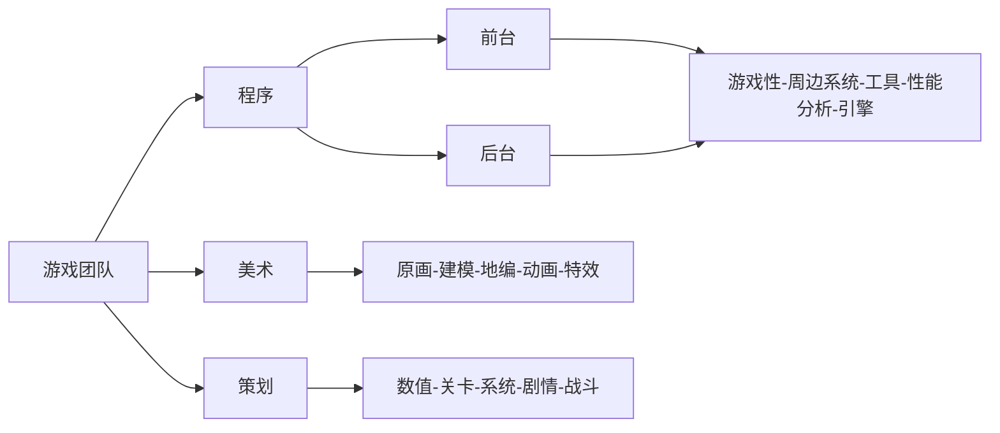
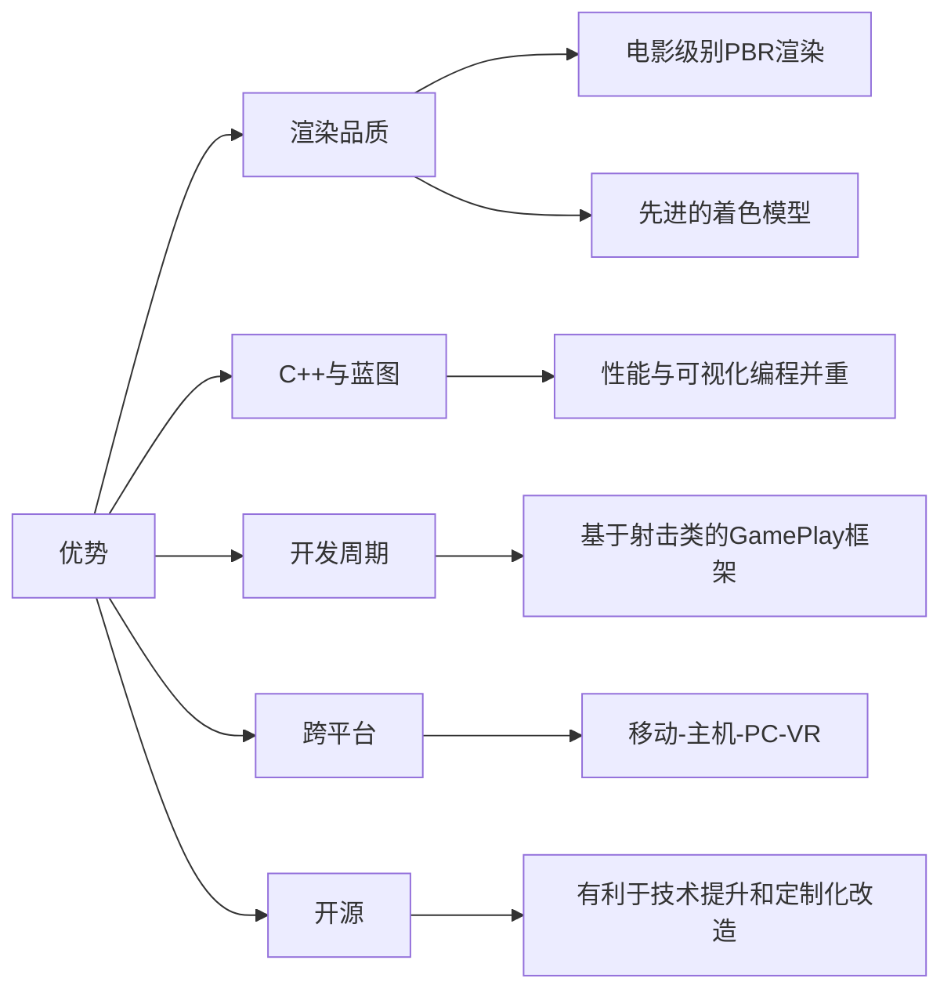

# 概览

>课程内容：
>- UE学习途径和方法的介绍
>- UE编辑器使用和编程技巧
>- UE引擎工具了解

>课程目标
	>-  熟悉UE引擎的编辑器操作，了解UE引擎的游戏模式框架
	>-  能够独立获取和编译UE源码
	>- 能够在UE引擎中实现蓝图编程和C++编程
	>- 能够使用UE引擎构建Andorid平台游戏安装包
	
>本节课程作业：
>- 源码编译UE4/5，新建一个C++工程，进行简单场景编辑和工程设置
>- 编译并构建安装包，确保能够用来将游戏工程安装到手机正常运行（若无Andorid手机可构建桌面版本）

# 游戏团队的典型结构

# 游戏引擎介绍

## Unreal

## 商业引擎
|名称|所属|是否开源|知名作品|
|:----:|:----:|:----:|:----:|
|Unity|Unity Technologies|闭源，商业引擎|大部分手游，独立游戏|
|Cry Engine|Crytek|开源，商业引擎|孤岛惊魂，孤岛危机|
|Source2|Valve|未开源，商业引擎|Half-Life: Alyx，CS2，Dota2|
|EA|Frostbit Engine|内部引擎|战地系列|
|顽皮狗|Naughty Dog Game Engine|内部引擎|神海系列，美末系列|
|R星|RAGE|内部引擎|GTA系列，荒野大镖客系列|
|育碧|AnvilNext2|内部引擎|刺客信条系列|
|动视|IW Engine（基于id Tech3）|内部引擎|使命召唤系列|

## 游戏引擎架构

